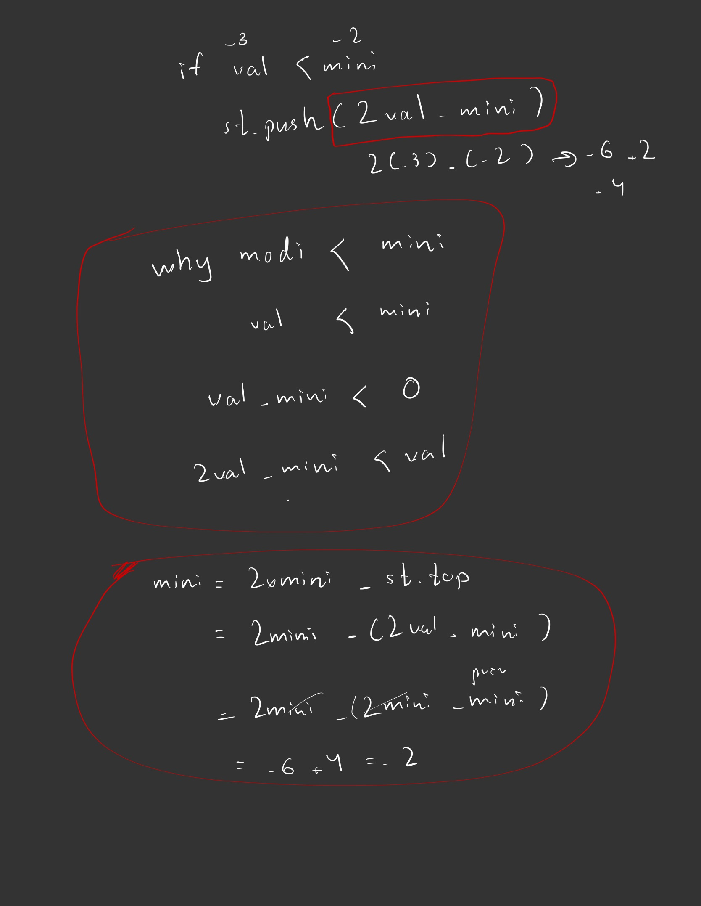

# Problem Solving With Python

## Arrays & Hashing

1. containDuplicate 
   - Use set() 

2. ValidAnagram
    #### Solu1
    - Use Counter or deafault hashmap to get | 'd' : 1 | and check if they are equal

    #### Solu2
    - Take advatage of ord char to get unique index
    - | += 1 cancel wth -=1 |

3. Two Sum
    - Use Target-currNum formula recheck wth hashmap

4. GroupAnagrams
    - Take advatage of ord char to get unique index
    - Use Hashmap to store same index no. count str into list

5. Top K Frequent Elements
    - Purpose to elect the most frequent one at top of the level
    - Use Bucket Sort
    - Range for len of arr, cuz it is not beyond more than that

6. Encoding & Decoding
    - len(str) + "#" + str
    - use two pointer i and j wth **while loop** 

7. Product ExceptSelf
```bash
├── Use For loop wth l_mul and r_mul (i and j = -i-1) 
│   ├── [1,2,3,4]
│       ├── [1, 1, 2, 6]
│       ├── [24, 12, 4, 1]
        
```

8. longestConsecutive
    - Check if num-1 so that that num should be the 1st number of the sequence
    - Keep searching and upadting currNum and count to find the max len
   
9. isValidSudoku
    - rows[r], cols[c], squares[(r//3,c//3)]

## Two Pointers

10. isPalindrome
    - use while loop wth TwoPointer Alogorithm
    - 1 step forward +=1 and 1 step backward -=1

11. Two_Integer_Sum_II
    - use outer loop wth i & innner loop wth j using while to 
    - going with standard i number 1st followed by j series to cross over one complete array

12. Three Sum
    - **Sorted 1st** to avoid duplicates
    - Use for i loop for outer, and while loop for inner coming across until while j < k

13. Container_With_Most_Water
    - One side wth min height and one wth max height to containize water
    - min(height[l],height[r]) * (r-l)
    ```bash
    if height[l] <= height[r]: 
        l+=1
    else: 
        r-=1
    ```

14. Trapping_Rain_Water
    - Prefix and Suffix 
    - left[0]*n for left most greatest num
    - right[0]*n for right most greatest num
    - res += min(leftMax[i],rightMax[i]) - height[i]

15. Best Time to Buy and Sell Stock
    - use two pointers outer for loop wth i followed by inner while loop j
    - if prices[i] > prices[j]: break

## Sliding Window

16. Length Of Longest Substring
    - Use sliding window
    - Becareful of **l <= s[r]**

17. Character Replacement
    - Use sliding window
    - **changes = (r-l+1)-maxFreq**
    - Use outer for loop and inner while loop until changes > k

18. Check Inclusion (Permutation)
    - Same concept wth Anagram, but finding subset in whole text
    - So, take unique index of char
    - Becareful of **r-=1**

19. Minimum Window Substring 
    - use the concept of len, if count == len(s) -> substring
    - use one hashing -> rightChar -= 1, then leftChar += 1

## Stack & queue

20. Sliding Window Maximum
    - use monotonic decreasing order
    - remove out of bound index if dq and frontIndex == i-k
    - append if i >= k-1

21. Valid Parentheses 
    - use stack
    ```bash 
    if stack and stack[-1] == dict[char] -> pop
    else return False
    ```

22. Minimum Stack
    - Before push, check if val < mini -> 2val - mini
    - Before pop, check if pop_val < mini -> mini = 2mini * pop_val
    - formula
     